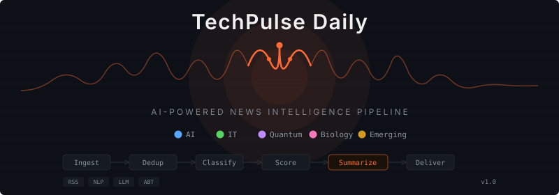

<p align="center">
  
</p>

<h1 align="center">📡 TechPulse Daily</h1>
<p align="center">
  <strong>AI-Powered Tech & Science News Intelligence Pipeline</strong>
</p>
<p align="center">
  Automated RSS ingestion → NLP classification → relevance scoring → LLM-powered storytelling summarization → multi-channel delivery
</p>

<p align="center">
  
  
  
  
  
</p>

<p align="center">
  <a href="#pipeline-architecture">Architecture</a> •
  <a href="#data-science-techniques">Techniques</a> •
  <a href="#sample-output">Sample Output</a> •
  <a href="#installation">Installation</a> •
  <a href="#customization">Customization</a> •
  <a href="#idea-integration-radar">Idea Radar</a>
</p>

---

## The Problem

Technology professionals need to stay informed across multiple fast-moving domains (AI, cybersecurity, quantum computing, biotech, semiconductors), but:

- RSS feeds produce **200+ articles/day** — most are noise
- Technical jargon makes cross-domain reading slow and exhausting
- No existing tool **ranks by actual relevance** (source authority + recency + cross-source validation + impact)
- News summaries assume domain expertise the reader may not have

## The Solution

TechPulse Daily is an **end-to-end data pipeline** that ingests raw RSS feeds, applies NLP-based classification and multi-factor scoring, then uses LLM-powered summarization with a structured storytelling framework to produce a daily briefing **readable by anyone** — not just domain experts.

---

## Pipeline Architecture

```
┌─────────────┐     ┌─────────────┐     ┌─────────────┐     ┌─────────────┐
│   STEP 1    │     │   STEP 2    │     │   STEP 3    │     │   STEP 4    │
│   INGEST    │────▸│  NORMALIZE  │────▸│  CLASSIFY   │────▸│   SCORE     │
│             │     │  & DEDUP    │     │             │     │             │
│ 16+ RSS     │     │ URL dedup   │     │ Keyword     │     │ Multi-factor│
│ feeds via   │     │ Title sim.  │     │ frequency   │     │ composite   │
│ concurrent  │     │ (>80% =     │     │ matching    │     │ scoring     │
│ ThreadPool  │     │ duplicate)  │     │ across N    │     │ (5 signals) │
│             │     │ 36h recency │     │ user-defined│     │             │
│ ~200 raw    │     │ filter      │     │ categories  │     │ 0-10 scale  │
│ articles    │     │             │     │             │     │             │
│             │     │ ~80 unique  │     │ Labeled     │     │ Ranked      │
└─────────────┘     └─────────────┘     └─────────────┘     └─────────────┘
       │                                                           │
       ▼                                                           ▼
┌─────────────┐     ┌─────────────┐     ┌─────────────┐     ┌─────────────┐
│   STEP 8    │     │   STEP 7    │     │   STEP 6    │     │   STEP 5    │
│  DELIVER    │◂────│   FORMAT    │◂────│ SUMMARIZE   │◂────│  SELECT     │
│             │     │             │     │   (LLM)     │     │  TOP N      │
│ • stdout    │     │ Markdown    │     │             │     │             │
│ • .md file  │     │ grouped by  │     │ ABT story-  │     │ Category    │
│ • Telegram  │     │ category    │     │ telling     │     │ minimums    │
│ • JSON API  │     │ w/ emoji,   │     │ framework   │     │ enforced    │
│             │     │ timestamps, │     │ + analogy   │     │ then flex   │
│             │     │ impact tags │     │ bridging    │     │ slots by    │
│             │     │             │     │             │     │ score       │
│             │     │             │     │ Jargon-free │     │             │
│             │     │             │     │ 3-5 sent.   │     │ Top 15      │
└─────────────┘     └─────────────┘     └─────────────┘     └─────────────┘
```

## Data Science Techniques

This project demonstrates the following skills relevant to data science and ML engineering roles:

### 1. Data Ingestion & ETL
- **Concurrent I/O** — `ThreadPoolExecutor` fetches 16+ RSS feeds in parallel (~3s vs ~45s sequential)
- **Schema normalization** — heterogeneous RSS/Atom feed formats parsed into unified `{title, url, source, published, summary}` schema
- **Data quality filtering** — recency window, empty-field rejection, HTML tag stripping

### 2. NLP & Text Classification
- **Multi-label keyword frequency classifier** — each article scored against N user-defined category keyword lists
- **Configurable taxonomy** — categories loaded from external JSON; no code changes needed to add domains
- **Impact detection** — ordered rule-based tagger (BREAKTHROUGH > SECURITY > REGULATION > MILESTONE > RESEARCH > RELEASE > UPDATE) with specificity-first evaluation to prevent tag collision

### 3. Deduplication & Record Linkage
- **Two-pass deduplication pipeline:**
  - Pass 1: Exact URL normalization (strip query params, trailing slashes, case-fold)
  - Pass 2: Fuzzy title matching via `SequenceMatcher` (Ratcliff/Obershelp) with configurable threshold (default 0.80)
- **Conflict resolution** — when duplicates detected, retains the version from the higher-authority source

### 4. Multi-Factor Scoring Model
Five weighted signals combined into a composite relevance score (0–10):

| Signal | Weight | Method |
|--------|--------|--------|
| Source Authority | 30% | Pre-assigned credibility score per source (Nature=10, blog=3) |
| Recency | 25% | Decay function: ≤6h=10, ≤12h=8, ≤24h=5, >24h=2 |
| Cross-Source Validation | 20% | Count of similar titles across different sources (fuzzy match >0.6) |
| Impact Keywords | 15% | Tiered keyword detection (breakthrough=10, release=4, patch=1) |
| Category Balance | 10% | Boost for underrepresented categories to ensure diversity |

### 5. LLM Prompt Engineering
- **ABT (And-But-Therefore) Framework** — structured storytelling prompt that forces any LLM to produce consistent output format:
  - AND (context) → BUT (what changed) → THEREFORE (why it matters)
- **Analogy Bridging** — system prompt instructs LLM to replace all jargon with everyday analogies
- **Anti-hallucination guardrails** — prompt explicitly requires preserving original numbers/names
- **Model-agnostic design** — works with Ollama (Mistral, Qwen, Llama), OpenAI, Anthropic, or any OpenAI-compatible API
- **Output sanitization** — post-processing strips markdown artifacts, bullets, labels, and multi-line breaks regardless of model behavior

### 6. Information Retrieval & Ranking
- **Domain-minimum selection with flex slots** — guarantees coverage across all categories while allowing high-impact stories to claim extra slots
- **Configurable via JSON** — users set `min_stories` per category and `total_stories` globally

### 7. Structured Output & Multi-Channel Delivery
- **Markdown** — human-readable briefing with emoji domain headers, timestamps, impact tags
- **JSON** — machine-readable output for downstream pipelines (dashboards, databases, APIs)
- **Telegram Bot API** — auto-splitting for 4096-char message limit with smart section-boundary splits
- **stdout** — pipeable to any tool (`run.py | mail`, `run.py >> daily.log`)

---

## Sample Output

```
📡 TechPulse Daily — Sun, 27 Apr 2026
Top 15 stories across 5 categories
━━━━━━━━━━━━━━━━━━━━━━━━━━━━━━━━━━━━

🤖 AI

▸ AlphaFold 4 Predicts Protein-Drug Interactions with 95% Accuracy
📅 25 Apr 2026 · Nature News

Scientists have been trying to figure out which medicines will work on which
diseases, but testing every possible combination takes months and costs millions.
Google DeepMind built an AI called AlphaFold 4 that can predict how drugs
interact with the body's proteins — like a virtual chemistry lab that tests
millions of medicines in hours instead of months. It got the right answer 95%
of the time, and it's free for researchers to use.

RESEARCH · Source

▸ Anthropic Releases Claude Opus 4.6 with 200K Context
📅 26 Apr 2026 · Anthropic News

AI chatbots can only read a limited amount of text at once — like having a
conversation where the other person forgets everything after a few pages.
Anthropic just released Claude Opus 4.6, which can now read and remember up
to 200,000 words in a single conversation — that's roughly three full novels.
It's also 12% better at answering hard science questions and can now use
multiple tools at the same time.

RELEASE · Source

⚛️ Quantum

▸ Google DeepMind Achieves Quantum Error Correction Below Threshold
📅 26 Apr 2026 · Quanta Magazine

Quantum computers are incredibly powerful but extremely fragile — imagine
trying to do math with marbles that roll off the table every few seconds.
Google's team found a way to catch and fix these "rolling marble" errors
faster than they happen, using 105 tiny quantum switches working together.
This is the first time anyone has achieved this outside of computer
simulations, and it's a critical step toward quantum computers that
actually work reliably.

BREAKTHROUGH · Source

... (15 stories total across 5 categories)

━━━━━━━━━━━━━━━━━━━━━━━━━━━━━━━━━━━━
📊 Sources: 16/16 feeds
📰 Evaluated: 187 → Selected: 15
⏱ Pipeline: 14.7s
🧠 Model: minimax-m2.5:cloud
📖 Storytelling: ABT (And-But-Therefore) + Analogy Bridging
```

---

## Installation

### Prerequisites
- Python 3.10+
- [Ollama](https://ollama.ai) (or any OpenAI-compatible LLM endpoint)

### Quick Start

```bash
git clone https://github.com/moltgoldfallen-droid/techpulse-daily.git
cd techpulse-daily
pip install -r requirements.txt

# Test without LLM (uses raw RSS summaries)
python run.py --no-llm

# Full run with LLM summarization
python run.py

# Full run + Telegram delivery + JSON export
export TELEGRAM_BOT_TOKEN="your_token"
export TELEGRAM_CHAT_ID="your_chat_id"
python run.py --telegram --json
```

### Environment Variables

| Variable | Required | Default | Description |
|----------|----------|---------|-------------|
| `TECHPULSE_MODEL` | No | `minimax-m2.5:cloud` | Ollama model name |
| `TECHPULSE_OLLAMA_URL` | No | `http://127.0.0.1:11434/api/generate` | LLM API endpoint |
| `TELEGRAM_BOT_TOKEN` | For Telegram | — | Telegram Bot API token |
| `TELEGRAM_CHAT_ID` | For Telegram | — | Target chat/channel ID |

### Cron Setup (Daily Automation)

```bash
crontab -e
# Add:
30 6 * * * cd /path/to/techpulse-daily && /usr/bin/python3 run.py --telegram --json >> techpulse.log 2>&1
```

---

## Customization

### Adding a New Category

Edit `categories.json` — no code changes needed:

```json
{
  "Finance": {
    "emoji": "💰",
    "min_stories": 2,
    "keywords": ["stock market", "federal reserve", "interest rate", "earnings", "IPO", "cryptocurrency", "bitcoin"],
    "feeds": {
      "Bloomberg Tech": "https://feeds.bloomberg.com/technology/news.rss",
      "Financial Times": "https://www.ft.com/rss/home"
    },
    "source_authority": {
      "Bloomberg Tech": 9,
      "Financial Times": 10
    }
  }
}
```

### Removing a Category

Delete the category block from `categories.json`. The pipeline auto-adjusts.

### Using a Different LLM

```bash
# OpenAI-compatible endpoint
export TECHPULSE_MODEL="gpt-4"
export TECHPULSE_OLLAMA_URL="https://api.openai.com/v1/completions"

# Local Ollama with different model
export TECHPULSE_MODEL="llama3:8b"

# Any model works — the ABT prompt is model-agnostic
```

### Custom Config File

```bash
python run.py --config my_categories.json
```

---

## Idea Integration Radar

An optional second-stage pipeline (`idea_radar.py`) that reads the TechPulse output and evaluates each story against your active software projects for integration opportunities.

```bash
# Run after TechPulse
python run.py --json
python idea_radar.py --json
```

It dynamically discovers projects by scanning directories for `SKILL.md` files, extracts tech stacks and known gaps, then uses the LLM to find concrete integration matches (specific libraries, APIs, or tools — not vague thematic overlaps).

---

## Project Structure

```
techpulse-daily/
├── run.py              # Main pipeline (8 stages)
├── idea_radar.py       # Integration idea matcher (optional)
├── categories.json     # User-editable category config
├── cron.sh             # Cron runner script
├── requirements.txt    # Python dependencies
├── SKILL.md            # OpenClaw skill definition
├── assets/
│   └── techpulse-banner.svg
├── techpulse_daily_output.md    # Generated briefing (gitignored)
├── techpulse_daily_data.json    # Generated JSON (gitignored)
└── README.md
```

---

## Technical Decisions

| Decision | Rationale |
|----------|-----------|
| `feedparser` as only dependency | Minimizes supply-chain risk; stdlib handles HTTP, JSON, threading, regex |
| `ThreadPoolExecutor` over `asyncio` | Simpler code, same I/O performance for 16 feeds, no async dependency |
| `SequenceMatcher` for dedup | No external NLP library needed; Ratcliff/Obershelp handles title similarity well at 0.80 threshold |
| ABT storytelling framework | Research-backed narrative structure (Randy Olson, "Houston, We Have a Narrative") that forces jargon-free output from any LLM |
| External `categories.json` | Separation of concerns — domain knowledge lives outside code; non-developers can customize |
| Multi-channel output | stdout for piping, .md for reading, .json for APIs, Telegram for mobile — same pipeline, four outputs |
| Impact tag specificity ordering | Checks BREAKTHROUGH before RELEASE prevents a "breakthrough release" from being tagged as mere RELEASE |

---

## Performance

| Metric | Value |
|--------|-------|
| Feed ingestion (16 feeds, concurrent) | ~3–5s |
| Deduplication (200 articles) | <0.5s |
| Classification + Scoring | <0.5s |
| LLM summarization (15 stories) | ~30–60s (model-dependent) |
| Total pipeline (with LLM) | ~45–90s |
| Total pipeline (no LLM) | ~5–8s |
| Memory usage | <50MB |

---

## Roadmap

- [ ] Hacker News API integration (Tier 2 source, no RSS needed)
- [ ] Topic clustering across days (trending topic detection)
- [ ] Personalized feed learning from user engagement signals
- [ ] Web dashboard (D3.js visualization of story graph)
- [ ] Multi-language summary support
- [ ] Slack / Discord delivery channels

---

## License

MIT

---

<p align="center">
  Built as a demonstration of end-to-end data pipeline engineering,<br>
  NLP text classification, multi-factor scoring, and LLM prompt engineering.
</p>
